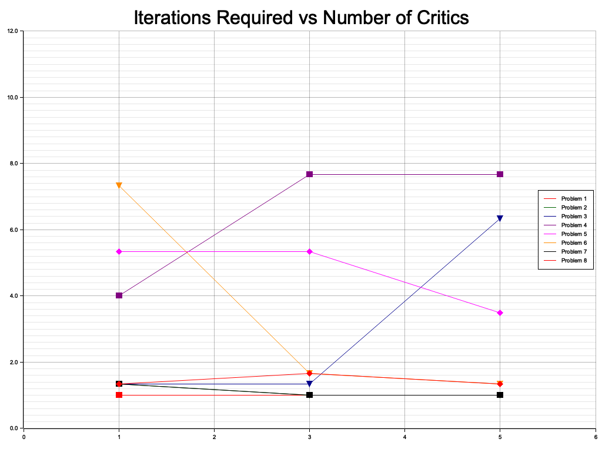
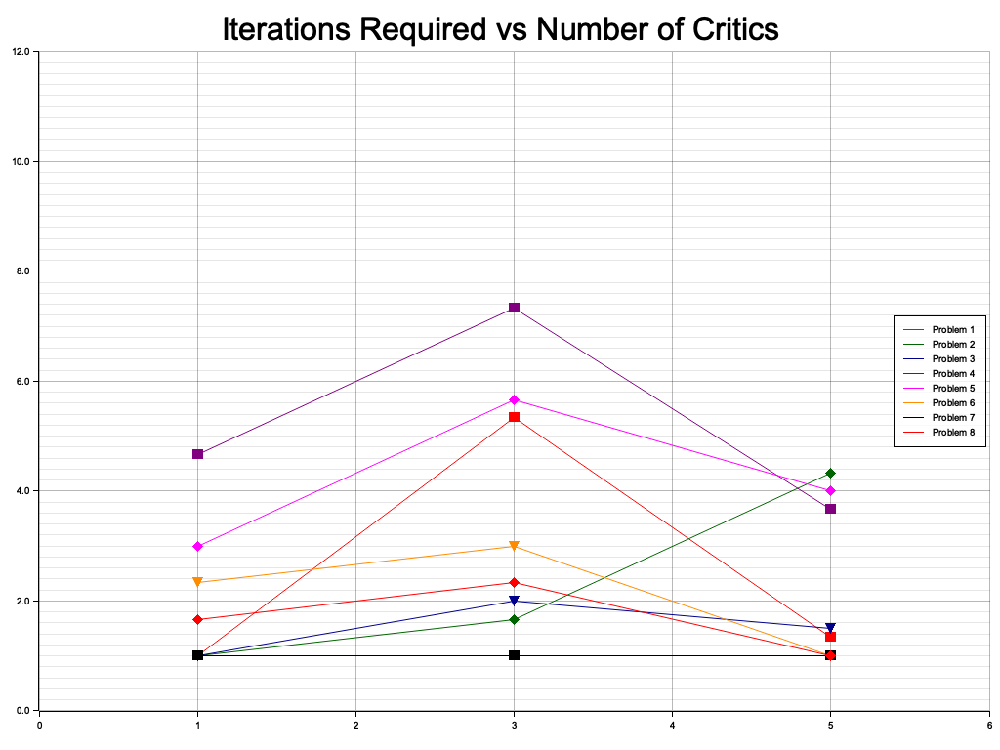

<!-- omit from toc -->
# AI Coding Critics

<!-- omit from toc -->
### Can AI fix its own code?

- [Intro: Recursive LLMs](#intro-recursive-llms)
- [The Agents](#the-agents)
  - [AI Coder Agent](#ai-coder-agent)
  - [AI Critic Agent](#ai-critic-agent)
    - [Design AI Critic Agent](#design-ai-critic-agent)
    - [Correctness AI Critic Agent](#correctness-ai-critic-agent)
    - [Syntax AI Critic Agent](#syntax-ai-critic-agent)
    - [General AI Critic Agent](#general-ai-critic-agent)
  - [AI Fixer Agent](#ai-fixer-agent)
  - [Tester Agent](#tester-agent)
- [The Code](#the-code)
  - [Running the code](#running-the-code)
  - [Problem format](#problem-format)
- [Limitations](#limitations)
  - [Compiler and Test Line Numbers](#compiler-and-test-line-numbers)
  - [Self-fulfillment](#self-fulfillment)
  - [Coding Puzzles](#coding-puzzles)
- [Data](#data)
  - [How to read the data](#how-to-read-the-data)
  - [Plots](#plots)
- [Observations and Discussion](#observations-and-discussion)
  - [Nonlinear Progress](#nonlinear-progress)
  - [Deduping in an AI World](#deduping-in-an-ai-world)
  - [AI Stubbornness](#ai-stubbornness)
- [Answers to the Key Questions](#answers-to-the-key-questions)
  - [AI Critic Structure](#ai-critic-structure)
  - [AI Critic Count](#ai-critic-count)
  - [AI Critic Convergence](#ai-critic-convergence)
  - [Bottom Line](#bottom-line)

## Intro: Recursive LLMs

Today's LLMs like GPT-4 can write code, but notoriously, their code is typically buggy and
incomplete with mistakes ranging from simple syntax errors to hallucinated functions and libraries.
Even so, they are incredible tools for developers, providing a new dimension to coding: almost fully
intelligent help. But if they can help developers fix their coding errors, then can AI correct their
own mistakes?

This repo provides `ai_critics`, a Rust program that solves coding problems using AI to write
initial code, then review and correct the code until it successfully compiles and passes its tests.

This repo also creates a new kind of software: AI Algorithms. As AI is deployed to developers, we'll
need to craft new algorithms that arrange and pipeline AI interactions to solve coding problems. As
we'll see below, AI solves problems in ways that are uniquely different from traditional algorithm
design and uniquely different from the ways human developers solve coding problems. As a result,
we'll need to design algorithms that incorporate AI into their design, not simply as "insert
intelligence here", but instead with new algorithms that leverage AI's approaches and work around
their limitations in problem solving. This repo is an example.

In this case, the AI Algorithm uses GPT-4 to correct its own code. Specifically: `AI code -> AI
review -> AI fix -> compile/test -> repeat`. Will it work? How can we characterize the behavior of
this algorithm?

Turning LLMs into AI critics, reviewing and correcting their own code, raises several key questions:

1. How should AI critics be structured? Are different kinds of code review that specify different
   potential problems more useful than single, comprehensive, review prompts?
1. Does the number of AI reviewers matter? Do more Ai critics find more mistakes more quickly? Or do
   they confound each other, creating more review loops before finding a solution?
1. Does the AI review loop converge? That is, will the code/review/correct cycle eventually
   produce a final answer with no further review comments? Or will the AI review loop diverge,
   whether through continuously introduced mistakes or through endless, perhaps conflicting advice or unrepaired code defects?

This repo answers these questions (See [Answers to the Key Questions](#answers-to-the-key-questions)). Here's how it works:

1. The `AI Coder` agent, given a coding problem, writes code that solves the problem.
2. `AI Critic` agents review the code, approving it as correct or returning a list of suggested
   fixes and improvements.
3. If there are any errors or suggested improvements, an `AI Fixer` agent combines uses them to
   write new code. Go to to Step 2 to recheck for errors introduced by the `AI Fixer`. 
4. If/when the critics judge that the code is correct, then a non-AI `Tester` agent compiles and
   tests the code. 
   * If the `Tester` agent finds that the code fails to compile or pass its tests, then go to step
   3, giving the errors to the  `AI Fixer` to correct. 
   * If the code compiles and passes its tests, then exit with success.

The process continues until the code passes its tests or an iteration limit is reached.

The `AI Coder`, `AI Critic`, and `AI Fixer` agents all do their work primarily by asking GPT-4 to
perform their tasks.

## The Agents

In the research literature, the word "agent" has been used to refer to a program that interacts with
its environment with some autonomy and intelligence, performing tasks that advance the program's
goals. The term is sometimes overused when it simply describes fixed subroutines. In this project,
the agents really are simple subroutines that make OpenAI API calls. However, they call actually
intelligent software, GPT-4, with its autonomy in how it responds to requests! Arguably, for the
first time, software using LLM APIs really are true autonomous intelligent agents.

There are several kinds of agents that create the code/review/fix/test loop. Each agent has a
system prompt and a user prompt as is standard for GPT-4 API calls.

### AI Coder Agent

The `AI Coder` agent calls GPT-4 with a coding problem in the user prompt like:

```
There are a total of numCourses courses you have to take, labeled from 0 to
numCourses - 1. You are given an array prerequisites where prerequisites[i] =
[ai, bi] indicates that you must take course bi first if you want to take course
ai.

For example, the pair [0, 1], indicates that to take course 0 you have to first
take course 1. Return the ordering of courses you should take to finish all
courses. If there are many valid answers, return any of them. If it is
impossible to finish all courses, return an empty array.
```

This and other coding problems are sourced from
[LeetCode](https://leetcode.com/problems/course-schedule-ii/) and
[GeeksforGeeks](https://www.geeksforgeeks.org/find-the-ordering-of-tasks-from-given-dependencies/).

The `AI Coder` has a system prompt like:

```quote
Write the requested program in Rust. Include complete unit tests. Return the code as JSON in a string field called `code`.

Any clarifying explanations should be included in the code as // comments.
Be sure that the tests demonstrate that the code solves the requested problem.

Any `assert` used should include a custom message with a unique 6-digit hex number labelled `assert_id` that uniquely identifies the assert line so that line numbers are not required.

```

The code given to GPT-4 does not have line numbers, so the instruction to create an `assert_id` for
each assert allows GPT-4 to find assertion errors.

The `AI Coder` returns code that should be a complete a Rust program that solves the problem,
including unit tests. The returned code is parsed into a single string. No further structuring or
analysis is done before passing to the `AI Critic` agents.

### AI Critic Agent

The `AI Critic` agents review the code proposed by the `AI Coder`. There are several types of AI
Critic, depending on the type of code review they are asked to do. These agents receive the same
user prompt, but different system prompts.

To create the user prompt given to GPT-4, the coding problem and the current code are combined with
with the following:

```
Evaluate this code based on the criteria below. Make no comments or explanations.
Return JSON with two fields:
1. a field named `lgtm` with value `true` if the code is correct, else `false`.
2. a field `corrections` containing list of the errors, if any, else `None`.
```

There are 4 types of `AI Critic`: `Design`, `Correctness`, `Syntax`, and `General`. The first three
perform specialized reviews as suggested by their names and detailed below. Instead of using the 3
specialized agents, `ai_critics` can be run with the `--general_critic_only` flag to use just the
generalized critic. This option allows us to analyze whether separate, specific reviews are more
effective than simple, generalized ones. See below for the results.

A user-configurable number of `AI Critic` agents review the proposed code and return corrections if
the code is judged incorrect. The corrections are aggregated and given to the `AI Fixer` agent.

#### Design AI Critic Agent

`Design AI Critics` use the following system prompt:

```
Evaluation Criteria: Evaluate the _design_ of the solution, considering the following questions:
1. Is this the right the design to solve the problem?
2. Does the method chosen meet the constraints of the problem?
3. Does it use a the correct algorithms and data structures to solve the problem?
```

#### Correctness AI Critic Agent

`Correctness AI Critics` use the following system prompt:

```
Evaluation Criteria: Evaluate the _correctness_ of the solution, considering the following questions:
1. Does the code correctly implement the intended solution approach?
2. Does the code generate the expected output?
3. Does the output meet the original problem constraints?
4. Are there enough tests to demonstrate the correctness of the solution?
5. Do the tests correctly capture situations that validate or invalidate the solution?
```

#### Syntax AI Critic Agent

`Syntax AI Critics` use the following system prompt:

```
Evaluation Criteria: Evaluate the _syntax_ of the solution, considering the following questions:
1. Are there any syntactic errors?
2. Will the code and tests compile and run?
3. Are there any language errors such as borrowing violations or lifetime problems?
4. Are there any cleanups needed such as unused variables or imports?
```

#### General AI Critic Agent

Instead of the three specialized critics described above, the system can be configured to use a
single, simpler reviewer. The generalized review `AI Critics` uses the following system prompt:

```
Review the code for design, correctness, and syntax issues.
```

### AI Fixer Agent

The `AI Fixer` agent corrects the current code using the feedback of the `AI Critic` agents or the
compilation/test errors found by the `Tester` agent. Its system prompt is:

```
Correct the code, returning the fixed code as JSON in a string field called `code`.";
```

The user prompt for `AI Fixer` agent combines the code, the feedback, and the appropriate base prompt.

- Code Review Comments:

For code reviews, the `AI Fixer` base prompt is:

```
Specifically address these code review issues:
```

- Compiler Errors:

For compiler errors, the `AI Fixer` base prompt is:

```
Fix the code so that it compiles.
Correct the compilation errors without changing the code's functionality.
The code failed to compile with the following errors:
```

- Test Failures:

For unit test errors, the `AI Fixer` base prompt is:

```
The code failed its unit tests as shown below. Do the following:
1. Match the given `assert_id` value to the assert() in the code to find the assertion that
    failed.
2. Determine if the test design is correct for the test that failed. If not, do not correct the
    assertion, but instead correct the test.
3. If the test design is correct, determine if the assert line is correct. If not, write the
    correct line.
4. Fix the code so that it passes the test.
This is the output of the failed test:
```

The `AI Critic` agents and `AI Fixer` agent continue to rewrite the code until all of the critics
agree that the code is correct or until the number of allowed attempts is exceeded.

When all of the critics agree that the code is correct, it is passed to the `Tester` agent for
compilation and testing.

### Tester Agent

The Tester agent is not AI-based and does not call GPT-4. Instead, it uses the Rust compiler to
compile the code and run its unit tests. Errors in compilation or testing are returned to the `AI
Fixer` agent for correction as described above.

## The Code

The `ai_critics` code is primarily focused on reliably interacting with the OpenAI API. In addition
to the intelligent code review goal of the repo described above, the code demonstrates how to handle
a number of issues:

1. The API requests and instructions to GPT-4 request that responses are returned as JSON. GPT-4
   does so, but can be inconsistent in the exact JSON structure returned. For example, asked to
   return the code a JSON string in a field called `code`, GPT-4 will sometimes return the code as a
   JSON `[Object {"code": Object("...")}]` instead of a `[Object {"code": String("...")}]`. This
   code demonstrates how to handle these kinds of inconsistencies.
1. The API sometimes returns long runs of spaces and newlines. This is apparently generated by the
   GPT model, uncaught by the API. The problem is eventually terminated when the output reaches the
   requested maximum length. The API will return a `ChatChoice` with a `FinishReason` of `Length`.
   However, this is inefficient, especially as the requested response lengths increase. So this code
   demonstrates how to catch the terminate the runaway response early.
1. It demonstrates the use of streaming responses, providing continuous feedback to the user
   while GPT-4 figures out its answers.
1. It shows how to generate and return structured responses as JSON, as well as how to
   deserialize these into struct instances.
1. The code demonstrates request timeouts, retries, and other standard API error handling.

### Running the code

To run the code, set the `OPENAI_API_KEY` environment variable to a valid OpenAi
API key. View/create one [here](https://platform.openai.com/api-keys).

Note: The code is set up to run GPT-4, specifically `gpt-4-1106-preview`. If your API key corresponds to a different model, change the `MODEL` constant in `src/chatter_JSON.rs` . The list of available models is [here](https://platform.openai.com/docs/models/continuous-model-upgrades).

Export the API key in your shell, like:

```bash
$ export OPENAI_API_KEY=your_api_key
```

Protip: Use [direnv](https://direnv.net/) to set the environment variable for you whenever you `cd` into the directory.

Now you can run the code:

```bash
$ cargo run
```

or

```bash
$ cargo build
$ ./target/debug/ai_critics
```

to run with the first example problem, found in `problems/coding_problem1`. To try the other problems, or one in a file of your own, pass the filename:

```bash
$ cargo run -- --problem-file=problems/coding_problem3.txt
```

You can also specify how many copies of the critics to use:

```bash
$ cargo run -- --num-critics=3
```

So this command will run 3 each of the Design, Correctness, and Syntax critics.

...and/or whether to use only the generalized critic:

```bash
$ cargo run -- --general_critic_only
```

### Problem format

The coding problems are formatted as plain text files. Lines beginning with `#` are ignored. The problem is sent directly to GPT-4. There is no need to add any additional prompting to instruct GPT about the problem.

## Limitations

### Compiler and Test Line Numbers

The output of the Rust compiler and unit tests includes line numbers. However, the code given to the
AI do not include line numbers. This means that the AI will not be able to use the exact location of
the error.

This limitation can lead to ambiguous unit test failures:

```
thread 'tests::test_min_coins' panicked at /var/folders/dy/1_ns2s6s2x91htdf5xzc6xqc0000gn/T/.tmpIp3aZt/code.rs:37:9:
assertion `left == right` failed
  left: 2
 right: -1
```

Without access to the line numbers, finding this error is difficult.

In practice, this limitation led to runaway no-progress cycles in which the fixer failed to correct
a unit test so the same error recurred.

Compiler errors are less of any issue because the Rust compiler includes detailed information about
the nature of the error in the error message. Typically the description of the error is sufficient
for the LLM to find and correct the error.

A simple, effective mitigation is to ask GPT to return unique identifiers with the assertion errors:

```
Any `assert` used should include a custom message with a unique 6-digit hex number  labelled
`assert_id` that uniquely identifies the assert line so that line numbers are not required.";
```

### Self-fulfillment

A limitation of this code is that it asks GPT-4 to write the code _and_ the unit tests, which means
that the code could pass with trivial, incomplete, or erroneous tests. In practice, the AI does
attempt to create reasonable tests. However, there are typically only a few created. It is likely
that they are incomplete.

### Coding Puzzles

This project uses coding problems sourced from [LeetCode](www.leetcode.com) and
[GeeksForGeeks](www.geeksforgeeks.org). Citations are included in the problem files. As such, they
are algorithmic queries that are short, specific, and well-known. They are not representative of
real-world development tasks. Given that GPT-4 was trained on coding repositories, it is possible,
even likely, that it has directly trained on these specific problems.

## Data

The `collect_data.rs` program collected data over multiple runs and parameter variations of
`ai_critic`. The `plot_data.rs` program created the plots shown below. Each point in the plots is
the number of iterations the `ai_critics` required to find a solution for a given problem. Each data
point is averaged over 3 runs.

There are two plots below. One is for a configuration in which 3 specialized critics were used:
Design, Correctness, and Syntax. The other is for a configuration in which the single, general
critic was used.

### How to read the data

On the `x` axis, the plots show 3 different numbers of critics: 1, 3, and 5 AI critics. The `y` axis
shows the number of iterations required to find a solution. Each line shows the performance on one
of the coding problems.

To interpret the data, look at the lines as a group. The data can be interpreted as follows:

- **Angle**: If the lines are horizontal, it means that the number of critics had no effect on the
  number of iterations required to solve the problems. If the lines are positively sloped, if means
  that more critics makes the code review loop take longer to find the solution. If negatively
  sloped, using more critics speeds up the problem solving.
- **Clustering**: If the lines all overlap each other as a single bunch rather than as clearly
  separate lines, it means that the problems were all of equal difficulty for GPT-4. If the lines
  are spread out from each other, it means that the problems varied in their difficulty for GPT-4.
- **Correlation**: To the degree the data series for each problems forms a straight line, it means
  that there is a strong correlation between the number of critics and the iterations required. If
  curved, that relationship is non-linear. If the data is too noisy or forms a cloud of points, it
  means that no correlation exists.
- **Convergence**: If the lines converge, meaning they start spread out then reduce the spread as
  more critics are added, it means that more critics means more consistent problem solving time. In
  other words, performance varies based on a few critics, but problems become consistently easy with
  more critics. Divergence would mean that adding critics leads to more varied performance.
- **Plot similarity**: If both plots are similar in their location on the `y` axis, then it
  means that multiple, specialized critics do no better than a single, general critic.

Of the 48 runs shown in the plots, 5 failed to find a solution to the coding problem within 20
review/fix iterations (10.4%). 1 of these was in the specialized critics case and 4 in the
generalized critics case. This result could suggest that the specialized critics are more effective
at converging. However, the data below shows clearly contradicts this inference.

### Plots
Here are the plots:



Plot 1: This plot shows the number of iterations required to find a solution as the number of
critics is increased when 3 different critic types are used: Design, Correctness, and Syntax.

From review of the logs, it appears that the most common problem delaying a solution was correcting
unit tests when a test's expected values were incorrect. This is seen in the plots as large jumps in the required iterations.

As can be seen, in general, increasing the number of critics neither increased nor decreased
iterations required to converge to a successful solution. Even with as many as 15 AI code reviewers
the `ai_critics` review loop converged to a solution in only a few iterations.



Plot 2: This plot shows the number of iterations required to find a solution as the number of
critics is increased when a single, general critic type is used.

The plot for the single, general critic is similarly flat and spread. This suggests that 1), the
number of critics has no effect and 2), some problems were harder for GPT-4 than others.

As can be seen across both plots, there is some spread in the plotted lines, meaning that the
problems did present differing difficulty to GPT-4. However, in both plots, the lines are generally
flat, providing evidence that the number of critics made no difference.

It may appear that the first plot shows more clustering of the problems at lower `y` values. Ie,
more of the solutions are under 2.0 average iterations in the specialized critics plot than in the
general critics plot. This would be weak evidence that using specialized critics does help solve
problems more easily. However, the counts are actually remarkably similar, with 8 points above 2.0
in the specialized critics plot and 10 points above 2.0 in the general critics plot.

More data with more careful statistics could provide further disambiguation.

Summarizing:

- The AI critics loop converges, in general.
- The number of critics has no effect on the number of iterations required to find a solution.
- Some problems are easier for GPT-4 than others.
- Specialized critics do not help solve problems more effectively than a simple critic.

## Observations and Discussion

### Nonlinear Progress

Using GPT-4 for coding, reviewing and correcting, the code does not always converge directly to a
correct solution. Instead, it evolves in meandering directions:

- It sometimes fails to correct issues the AI code reviewers found.
- It sometimes misses obvious, easily corrected, issues that it was explicitly instructed to fix,
  such as removing unused `use` imports.
- It sometimes reintroduces defects that were previously fixed.
- It sometimes fails to follow user and system prompts, such as confirming that the unit tests are
  sufficient in number and correctly validating or invalidating the solution.

For example, incorrect unit tests present a challenge to the AI system. If the unit test is wrong,
the AI Fixer has to not correct the code to pass the test, but realize that the test assertion is
wrong and fix that instead. This challenge led to increased iterations of the AI system. During
these iterations, the AI Fixer sometimes introduced code errors that caused additional review cycles
to correct before returning to the test failure.

In general, they do solve the coding problems in only a few iterations. See the data shown below.

### Deduping in an AI World

The goal of using multiple critics is to find more issues with fewer iterations. However, critics often find the same issues, as this example output shows:

```
  Design Critic 1:
    Correct? false
    • The code uses a HashSet to track values, which is not necessary for a sorted linked list.
    • The code does not correctly remove all duplicates; it only skips adding a node if the value is already in the set or if the next node has the same value.
    • The code does not handle the case where there are multiple duplicates in a row correctly; it should remove the entire sequence of duplicates, not just prevent them from being added.
    • The use of HashSet introduces unnecessary space complexity; the problem can be solved with constant space complexity by taking advantage of the sorted property of the list.
  Correctness Critic 1:
    Correct? false
    • The code uses a HashSet to track values, which is not necessary for a sorted list.
    • The code does not correctly remove all duplicates; it only skips adding a node if the value is already in the set, which does not handle consecutive duplicates correctly.
    • The code does not handle the case where the first sequence of nodes are duplicates correctly; it will leave the first node of such a sequence in the list.
  Syntax Critic 1:
    Correct? false
    • The code does not correctly implement the removal of duplicate sequences. It uses a HashSet to track seen values, but the problem statement requires that sequences of duplicates be removed entirely, not just individual duplicates.
    • The code does not handle the case where the first sequence of nodes are duplicates.
    • The code does not handle the case where the last sequence of nodes are duplicates.
```

Note how similar the review comments are. Note, too how similar the Design, Correctness, and Syntax
review comments were, despite their specific prompts for different types of reviews.

These critics found several similar issues. However, they worded the descriptions differently.
Removing duplicates is more challenging as simple string matching will likely fail to catch many
duplicates. At the cost of another round trip to GPT-4, AI could deduplicate these. Doing so would
cause a net increase in tokens spent to obtain a small subsequent token savings, though. Nor is it
obvious that deduplicating review comments is necessary or beneficial to finding the correct coding
solutions.

### AI Stubbornness

To the problem of LLM hallucination, we can add stubbornness, the refusal to obey repeated requests.

Again and again, problems identified by the AI critics were not corrected in subsequent revisions. This issue often recurred even when the comment was the only issue identified by multiple critics.

For example, a common criticism returned by the LLM for some of these coding problems was to not use a HashSet. Yet the LLM persisted in including a HashSet. When it did switch to another data structure, it often refused a review comment to remove the HashSet import.

In one example, the review comments included:

```
• The code uses `Rc` and `RefCell` which are unnecessary and not used in the implementation.
...
• The code uses `Rc` and `RefCell` which are not used in the implementation and should be removed.
...
• Unused imports: `std::rc::Rc` and `std::cell::RefCell` should be removed as they are not used in the code.
```

In this case, even though these criticisms were made, the `AI Fixer` did not remove the imports and
in the subsequent review, the critics all next reported that the code was correct!


## Answers to the Key Questions

The introduction included several key questions raised by the code/review/rewrite approach to AI coding. Based on the results of this work, here are the answers:

### AI Critic Structure

1. How should AI critics be structured? Are different kinds of code review, specifying different potential problems, more useful than single, comprehensive, review prompts?

Structuring specific, detailed review requests using 3 specialized critics did not add value.
Perhaps surprisingly, simple requests were sufficient. Nor did using detailed review instructions
help. For example, an earlier version of the code had a single, comprehensive, review request system
prompt:

```
Specifically:
1. Combine similarly worded, but duplicate comments.
2. Decide if an alternative implementation or data structure is needed to
   implement the comments.
3. Follow the implications of the comments to their conclusions, such as
   removing `use` statements if you remove the items they import.
4. Choose the solution approach that implements all of the comments.
5. Write the code that implements the new solution.
6. Review and modify the code for solution correctness.
7. Review and modify the code for syntax errors.
8. Review and modify the code to ensure that all of the comments are
   implemented.
```

However, this was not found to be more effective than the current, simpler prompts for the AI
Critics. It was not clear that the AI critics were able to follow the steps specified in the
detailed prompt. They never made large algorithm design or problem approach changes, for example.

The AI critics were defined around different code review types: Design, Correctness, and Syntax. Each Critic used a prompt that specifically requested that the code be reviewed for these criteria. In fact, the data shows that the review specializations didn't matter. The coding problems were just as easily and quickly solved using a single review prompt, "Review the code for design, correctness, and syntax issues."

### AI Critic Count

2. Does the number of AI reviewers matter? Do more Ai critics find more mistakes more quickly?

Adding more AI critics did not find more issues more quickly. From 1 to 15 critics, the average
iterations required to find a solution was same no matter the number of critics. More critics might be expected to provide more insights in fewer review loops, speeding convergence. Or more critics could be expected to provide more comments to fix, leading to more review loops. In fact, neither occurred. The number of critics did not have any effect on the number of iterations required to find a solution.

This result may occur because of problems that were identified above: When used to review its own
code, the AI critics were not able to follow the detailed instructions. Nor did they fix all of the
problems identified in code reviews. Nor did they fix problems repeated in review after review. But
note that this autonomy, solving some of the problems as they chose to, would in fact prevent them
from being led in circles by reviewer/fixer repetition and mistakes. In short, their autonomy helps
them converge quickly by ignoring the additional comments and mistakes caused by more critics.

### AI Critic Convergence

3. Does the criticism converge at all? That is, will the code/review/correct cycle eventually
   produce a final answer with no further review comments? Or will the AI review loop diverge,
   whether through continuously introduced mistakes or through endless, perhaps, conflicting advice?

The AI critics loop converges about 90% of the time. For some of these, it can sometimes take
extended review iterations to find the correct solution. Thus, while there is promise for AI-based
algorithms, additional work is needed to increase convergence reliability and to discover ways to
avoid stuck-loops in which the algorithm fails to make progress.

### Bottom Line

AI can effectively review and correct its own code. It can be given a coding problem and solve it
with a series of reviews. There are a number of potential implications of this work:

- AI companies such as OpenAI could _today_ generate defect-free code by using internal AI code
  reviews before returning code to the user. Of course, doing so would add considerable costs as the
  models usage would jump roughly 200-300% for each coding query. Nevertheless, such an increase in cost
  is presumably far less than the costs required to train a superior LLM that produces defect-free
  code on the first try.

- AI Algorithms, that is Algorithms that utilize AI as components of their calculations, represent a
  new kind of computation. Again, AI algorithms are not code that uses AI to solve whole problems at
  once. Instead, AI Algorithms use AI as intelligent components that are combined in careful ways to
  generate specific solutions. Defining, characterizing, and proving the properties of such
  algorithms will become increasingly important as we explore what is possible with the new
  computational power available via AI.

- AI Algorithms, such as the `ai_critics` code in this repo, illustrate several of these issues.
  While the AI code/review/fix loop works, it can fail due to omitted corrections or a stubborn
  failure to fix assertions for example. Nor is it clear whether the autonomy of AI in what it
  chooses to review and correct is a help or a hindrance to the convergence to a correct solution.
  Characterizing these will be valuable future work.

- A positive contribution of this work is that it presents evidence that current AI, at least GPT-4,
  exhibits a strong insensitivity to prompt details. It is not the case that AI Algorithms will
  require considerable engineering effort spent carefully crafting the prompts used for AI
  components, at least as evidenced by this coding task.

